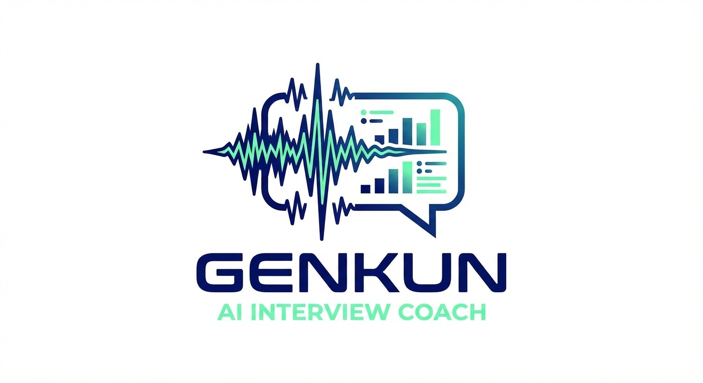
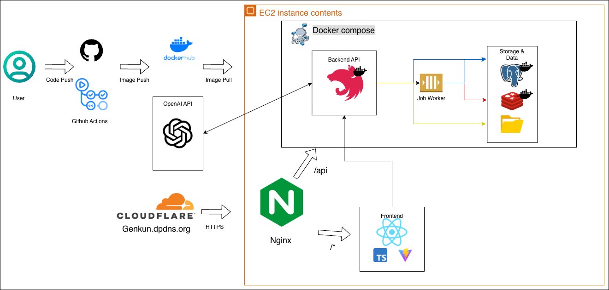
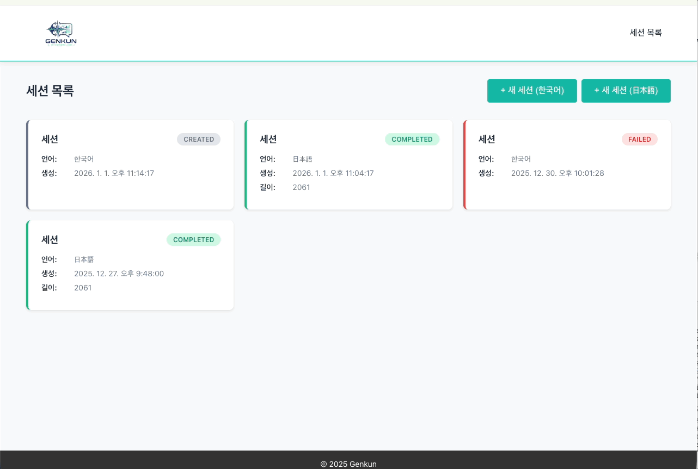
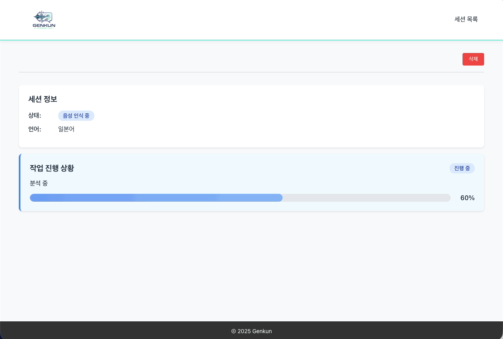
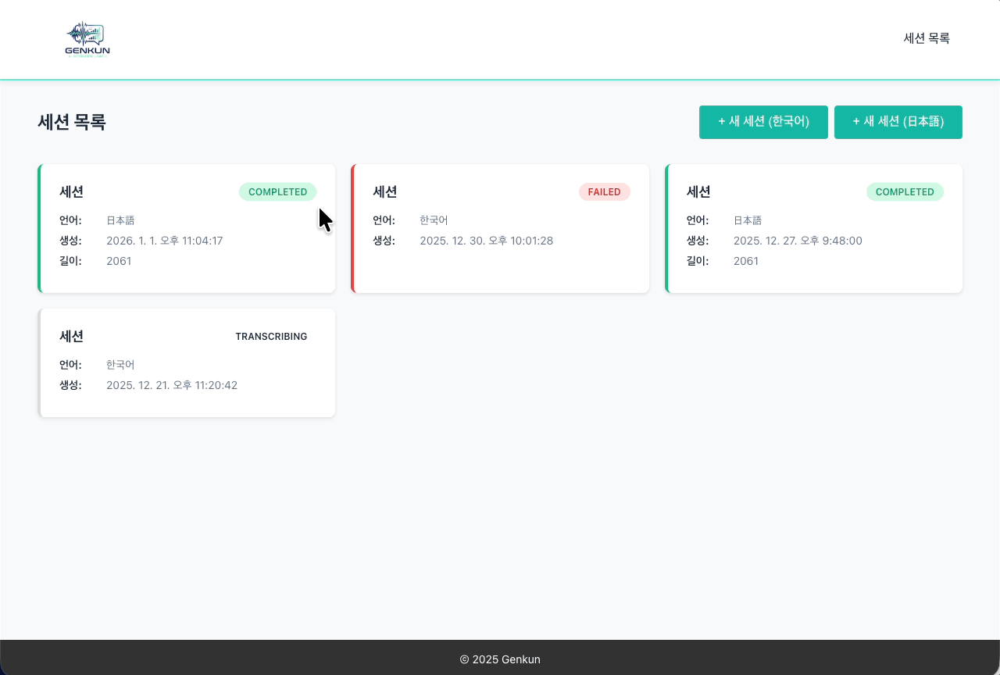
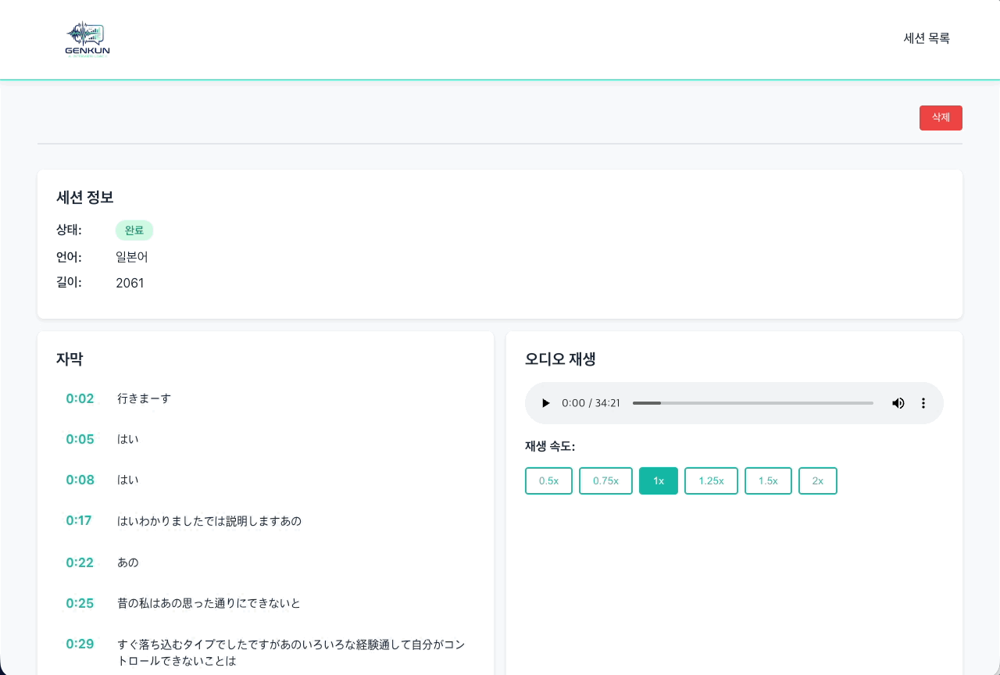
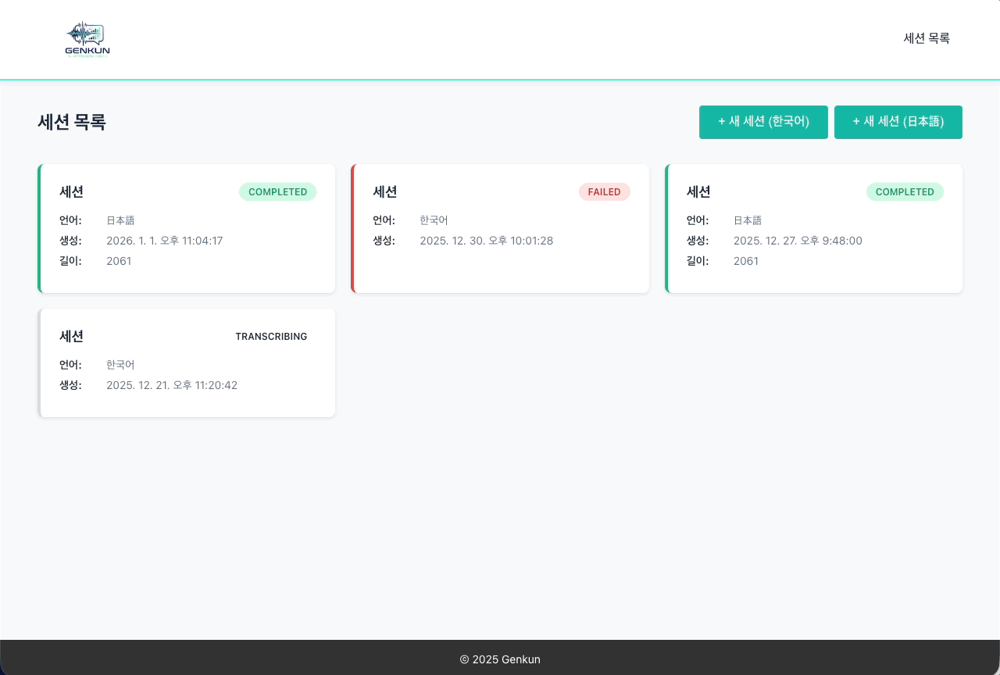

    
     
    <h2>言君(Genkun) - あなたの言語トレーニングパートナー</h2>

このプロジェクトのREDMEは日本語と韓国語で提供いたします。
 
이 프로젝트의 README는 한국어와 일본어로 제공됩니다.

- [日本語 (Japanese)](README.md)
- [한국어 (Korean)](README.ko.md)

 

 

## 📋 目次

1. [サービス紹介](#-サービス紹介)
2. [技術スタック](#-技術スタック)
3. [システムアーキテクチャ](#-システムアーキテクチャ)
4. [リポジトリ](#-リポジトリ)
5. [主な機能](#-主な機能)
6. [サービス画面](#-サービス画面)
7. [今後の計画](#-今後の計画)

 

## 🎯 サービス紹介

### AIによる音声分析で面接の受け答えを客観的にチェックする言語トレーニングウェブサービス

**言君(Genkun)**は、音声ファイルをアップロードすると**AIが発話内容を分析**し、**面接官の視点からのフィードバック**を提供する言語トレーニングウェブサービスです。

- 私の発音は正確か
- 話し方の癖はないか
- この答えは面接官に自然に聞こえるか

一人で練習しながらでは確認しにくかった部分を、データに基づいてフィードバックします。

- **URL**: [genkun-service](https://genkun.dpdns.org/)

 

## 💡 主な機能
- 音声ファイルのアップロードとAIによる発話分析
- 面接官の視点からの構造的なフィードバックと改善提案
- タイムラインに基づいた音声/分析結果の再確認
- セッション単位での練習記録の管理

 

## 🛠 技術スタック

### フロントエンド

### バックエンド

### インフラ

 

## 🏗 システムアーキテクチャ

### 全体システム構造

 

## 📂 リポジトリ

- **バックエンド**: [AI音声分析APIサーバー](https://github.com/GenKun-Ai/interview-analyzer)
- **フロントエンド**: [音声アップロードと分析結果UI](https://github.com/GenKun-Ai/interview-analyzer-web)

 

## ✨ サービス画面

### 1. 🎤 音声ファイルのアップロードとAIによる発話分析

- セッション単位で音声ファイルをアップロード
- アップロード後に自動で分析を進行

<table>
    <tr>
        <td align="center">
            
        </td>
        <td align="center">
            
        </td>
    </tr>
</table>

### 2. 🤖 面接官の視点からの構造的なフィードバックと改善提案

- 回答の構造と話し方の癖に関するフィードバックを提供
- 改善点を一目で確認

 

### 3. 🎵 タイムラインに基づいた音声と分析結果の再確認

- 音声と分析結果を時間軸基準で再確認
- 特定の発話区間を選択して聞き直し可能

 

### 4. 📊 練習記録の管理

- セッション別の練習記録を保存
- 以前の練習と比較可能

 

## 🚧 今後の計画

### 機能拡張
- [ ] **ユーザー認証と練習記録の高度化** (JWT)
- [ ] **リアルタイム進行状況の通知**
- [ ] **分析結果の視覚化** (チャート、グラフ)
- [ ] **音声比較機能** (以前の練習との比較)

### 技術改善
- [ ] **CI/CDパイプラインの構築** (GitHub Actions)

### インフラ
- [ ] **AWSへのデプロイ** (ECS, RDS, ElastiCache)
- [ ] **モニタリングシステム** (Prometheus, Grafana)

 

## 👤 開発者

**gwan**
- GitHub: [@ias-kim](https://github.com/ias-kim)
- Email: abcqkdnxm@g.yju.ac.kr

 
